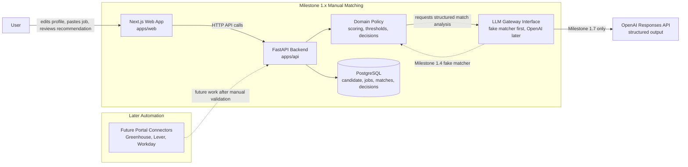

# Iterative Version Log

## Milestone 1.0 - Project Scaffold

Created the initial repository scaffold for the AI job-search copilot.

### Completed

- Confirmed the workspace was empty apart from Git metadata.
- Added a Next.js + TypeScript frontend in `apps/web`.
- Added a FastAPI backend in `apps/api`.
- Added a backend `/health` endpoint.
- Added basic frontend dashboard shell for the first manual matching workflow.
- Added Docker Compose PostgreSQL configuration.
- Added root and app-level environment-variable templates.
- Added backend test, lint, format, and type-check configuration with `pytest`, `ruff`, and `mypy`.
- Added frontend test, e2e, lint, format, type-check, and build configuration with Vitest, Playwright, ESLint, Prettier, and TypeScript.
- Added GitHub Actions workflow for frontend and backend checks.
- Added README with local setup instructions.

### Verification

- `npm run lint:web` passed.
- `npm run typecheck:web` passed.
- `npm run test:web` passed.
- `npm run test:e2e:web` passed.
- `npm run build:web` passed.
- `npm run format:check:web` passed.
- `npm audit` passed with 0 vulnerabilities.
- `ruff check .` passed.
- `ruff format --check .` passed.
- `mypy app` passed.
- `pytest` passed.

### How to Run Milestone 1.0

From the repository root:

```sh
cp .env.example .env
cp apps/api/.env.example apps/api/.env
cp apps/web/.env.example apps/web/.env.local
```

Start PostgreSQL:

```sh
docker compose up -d postgres
```

Install frontend dependencies:

```sh
npm install
```

Install backend dependencies:

```sh
cd apps/api
python3 -m venv .venv
source .venv/bin/activate
python -m pip install -e ".[dev]"
cd ../..
```

Run the backend:

```sh
cd apps/api
source .venv/bin/activate
uvicorn app.main:app --reload --port 8000
```

In a second terminal, run the frontend:

```sh
npm run dev:web
```

Open `http://localhost:3000`.

Useful checks:

```sh
npm run lint:web
npm run typecheck:web
npm run test:web
npm run test:e2e:web
npm run build:web
npm run format:check:web
npm audit
```

Backend checks:

```sh
cd apps/api
source .venv/bin/activate
ruff check .
ruff format --check .
mypy app
pytest
```

### Notes

- No job matching, authentication, OpenAI integration, or portal connectors were implemented.
- No commit or push was performed.
- Next.js 16 generated `apps/web/AGENTS.md` and `apps/web/CLAUDE.md`; they were left in place because Next recreates them during dev server runs.
- Backend tests currently show upstream deprecation warnings from FastAPI/Starlette test client dependencies, but the test passes.

### Recommended Next Task

Define backend domain models for candidate evidence, pasted job descriptions, normalized requirements, and saved job decisions. Then add the first database migration and CRUD API shape around those models.

## Milestone 1.1 - Domain Model and Persistence

Added the first backend persistence slice for structured candidate profiles and manually pasted job descriptions.

### Completed

- Added Pydantic domain models for:
  - Candidate profiles.
  - Candidate evidence items.
  - Manually pasted job descriptions.
  - Normalized requirements placeholder structure.
  - User job decision states.
- Added SQLAlchemy database models for:
  - `candidate_profiles`.
  - `candidate_evidence`.
  - `job_descriptions`.
  - `job_decisions`.
- Added SQLAlchemy session management and a FastAPI database dependency.
- Added Alembic configuration and the first migration.
- Added repository classes to keep persistence details out of API routes.
- Added API endpoints for candidate profile persistence:
  - `POST /candidate-profile`
  - `GET /candidate-profile`
  - `GET /candidate-profile/{profile_id}`
- Added API endpoints for manual job-description persistence:
  - `POST /jobs`
  - `GET /jobs`
  - `GET /jobs/{job_id}`
- Added backend tests for profile creation/retrieval and job creation/listing/retrieval.
- Verified the Alembic migration against local Docker PostgreSQL.

### How to Run Milestone 1.1

Start PostgreSQL:

```sh
docker compose up -d postgres
```

Install or refresh backend dependencies:

```sh
cd apps/api
source .venv/bin/activate
python -m pip install -e ".[dev]"
```

Apply migrations:

```sh
alembic -c alembic.ini upgrade head
```

Run the backend:

```sh
uvicorn app.main:app --reload --port 8000
```

Quick API checks:

```sh
curl http://localhost:8000/health
curl http://localhost:8000/candidate-profile
curl http://localhost:8000/jobs
```

Backend verification:

```sh
ruff check .
ruff format --check .
mypy app
pytest
```

### Verification

- `docker compose up -d postgres` started PostgreSQL successfully.
- `alembic -c alembic.ini upgrade head` applied migration `202609150001`.
- `ruff check .` passed.
- `ruff format --check .` passed.
- `mypy app` passed.
- `pytest` passed with 5 tests.

### Notes

- Tests use an in-memory SQLite database through FastAPI dependency overrides, so normal backend tests remain fast and do not require Docker.
- PostgreSQL remains the local and hosted persistence target.
- Job normalization is represented as a structured placeholder but no normalization logic has been implemented yet.
- Match results, scoring policy, OpenAI integration, and portal connectors are still future milestones.

## Next Milestones

## Overall System Diagram



### System Boundaries

- The browser never calls the LLM directly.
- The backend owns recommendation policy and final thresholds.
- The LLM returns structured evidence analysis, not the final business decision.
- PostgreSQL stores structured profiles, pasted jobs, normalized requirements, match outputs, prompt/model metadata, and user decisions.
- Portal connectors are intentionally future work and must respect site terms, robots directives, rate limits, access controls, CAPTCHA, and anti-bot protections.

## Quick Learning Links

Start with the resources in this order if you want to build along with the milestones.

### Frontend

- [Next.js App Router getting started](https://nextjs.org/docs/app/getting-started) - routing, layouts, pages, and the App Router mental model.
- [Next.js installation and TypeScript setup](https://nextjs.org/docs/app/getting-started/installation) - useful for understanding `next dev`, `next build`, file routing, and TypeScript support.
- [TypeScript Handbook](https://www.typescriptlang.org/docs/handbook/) - enough TypeScript to read and safely change the frontend.
- [Vitest getting started](https://vitest.dev/guide/index.html) - frontend unit tests.
- [Playwright installation guide](https://playwright.dev/docs/intro) and [running tests](https://playwright.dev/docs/running-tests) - browser-based e2e tests.

### Backend

- [FastAPI tutorial](https://fastapi.tiangolo.com/tutorial/) - API routes, request/response models, dependency injection, and validation.
- [FastAPI first steps](https://fastapi.tiangolo.com/tutorial/first-steps/) - smallest possible FastAPI app and route.
- [Pydantic validation getting started](https://pydantic.dev/docs/validation/latest/get-started/) - model validation and typed schemas.
- [Pydantic models](https://pydantic.dev/docs/validation/2.0/usage/models/) - how `BaseModel` works for structured API/domain objects.
- [pytest getting started](https://docs.pytest.org/en/stable/getting-started.html) - backend test basics.

### Database and Local Infrastructure

- [PostgreSQL tutorial](https://www.postgresql.org/docs/17/tutorial.html) - relational basics, SQL, joins, transactions, and constraints.
- [Docker Compose quickstart](https://docs.docker.com/compose/gettingstarted/) - local service orchestration, health checks, and volumes.
- [Alembic documentation](https://alembic.readthedocs.io/) - database migration tool to introduce when persistence starts.

### LLM Integration

- [OpenAI Structured Outputs overview](https://openai.com/index/introducing-structured-outputs-in-the-api/) - why schema-constrained model outputs matter.
- [OpenAI Node structured outputs guide](https://github.com/openai/openai-node/blob/main/docs/structured-outputs.md) - useful reference for Responses API structured parsing patterns.

### Suggested Learning Path

1. Run Milestone 1.0 locally and make one harmless text change in the dashboard.
2. Read enough Next.js App Router docs to understand `layout.tsx`, `page.tsx`, and route conventions.
3. Read FastAPI first steps, then inspect `apps/api/app/main.py` and `apps/api/app/api/health.py`.
4. Review the Milestone 1.1 Pydantic and SQLAlchemy models because candidate evidence and job normalization depend on strict schemas.
5. Learn PostgreSQL and Alembic before adding more persistence and migrations.
6. Learn Vitest, pytest, and Playwright as each milestone adds behavior that needs tests.
7. Read OpenAI structured outputs only after the fake matcher interface exists.

### Milestone 1.2 - Candidate Profile Editor

- Build frontend views for creating and editing a structured candidate profile.
- Support evidence items with project or position, description, skills, responsibilities, outcomes, and experience type.
- Add API integration between the profile UI and backend persistence.
- Add validation for required profile and evidence fields.
- Add frontend unit and e2e coverage for the profile workflow.

### Milestone 1.3 - Manual Job Intake and Normalization

- Add a UI for pasting a job description manually.
- Add backend normalization models for title, company, location, compensation, work mode, requirements, responsibilities, and preferred qualifications.
- Implement deterministic parsing and cleanup where possible before introducing LLM support.
- Persist normalized job records.
- Add tests for pasted job intake and normalized job display.

### Milestone 1.4 - LLM Matching Interface and Fake Matcher

- Define an LLM gateway interface behind dependency injection.
- Add a fake matcher implementation for tests and local workflow development.
- Define structured match output models for scores, gaps, evidence matches, rationale, and interview risks.
- Store model name, prompt version, token usage, and estimated cost fields, even if the fake matcher leaves them empty.
- Do not call OpenAI from the browser.

### Milestone 1.5 - Recommendation Policy

- Implement final backend recommendation policy outside the LLM.
- Apply the fixed thresholds:
  - `APPLY`: score 80-100 with no material mandatory gaps.
  - `CONSIDER`: score 65-79.
  - `SKIP`: score below 65.
- Add material mandatory gap override behavior.
- Ensure direct, transferable, knowledge-only, and missing experience classifications are preserved.
- Add tests that prove the LLM cannot independently change thresholds.

### Milestone 1.6 - Manual Match Dashboard

- Display structured recommendation results in the web dashboard.
- Show why the candidate matches, supporting evidence, missing requirements, interview risks, and work-preference conflicts.
- Add actions to mark a job as applied, saved, or skipped.
- Persist the user's decision.
- Add e2e coverage for the manual match workflow.

### Milestone 1.7 - OpenAI Responses API Integration

- Implement the real OpenAI matcher behind the existing LLM interface.
- Use structured output validation.
- Add prompt versioning.
- Store model name, prompt version, token usage, and estimated cost.
- Keep recommendation thresholds in backend policy code, not in the model prompt.
- Add tests using the fake matcher; keep real API calls out of normal test runs.

### Milestone 2.0 - Manual Matching Beta

- Polish the full manual workflow from profile creation through job recommendation and user decision.
- Add error states, loading states, empty states, and basic observability.
- Add seed/sample profile data for local development.
- Review recommendation quality against several real pasted job descriptions.
- Do not add portal scanning until manual matching is useful and trustworthy.

### Future Milestones - Portal Monitoring

- Add Greenhouse, Lever, and Workday connectors only after manual matching is validated.
- Respect site terms, robots directives, rate limits, access controls, and anti-bot protections.
- Add deduplication, posting-change detection, scheduled monitoring, and weekly reports.
- Add embedding-based evidence retrieval with `pgvector` when candidate evidence volume justifies it.
- Add resume selection and application preparation only with explicit user approval for consequential actions.
